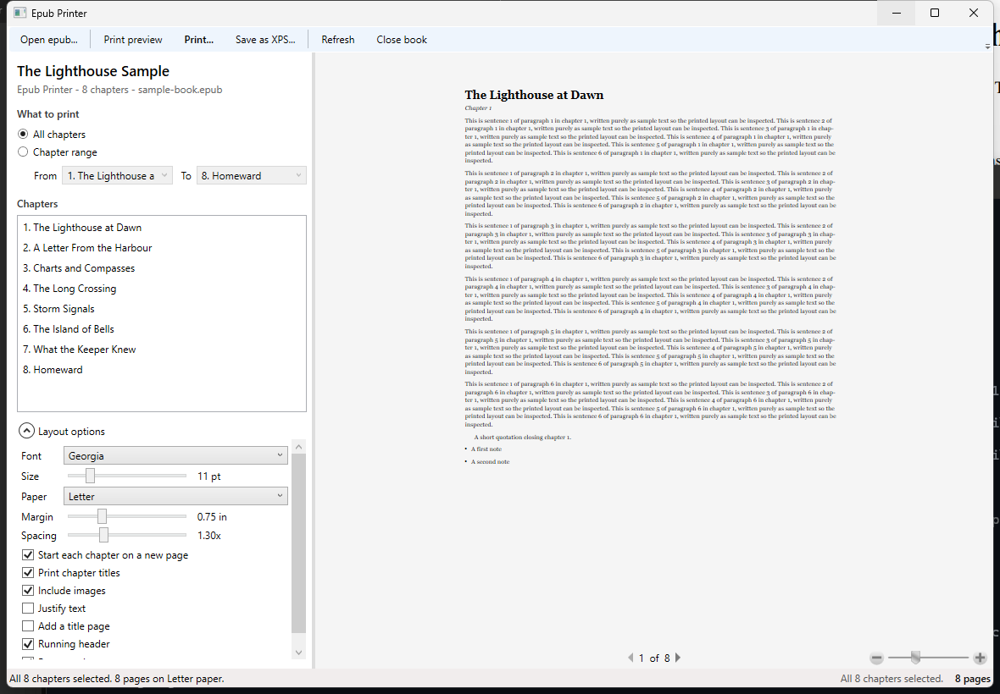

# Epub Printer

A small Windows desktop application (WPF, .NET 6) that opens `.epub` books and prints them
by chapter: either the whole book or a chapter range.



## Features

- **Open any EPUB 2 or EPUB 3 book** - chapter names come from the EPUB 3 navigation document
  or the EPUB 2 `.ncx`, falling back to the first heading in each document.
- **Print all chapters or a range** - pick "All chapters", or "Chapter range" and choose the
  first and last chapter. Right-click the chapter list for shortcuts
  ("Use as range start/end", "Print only this chapter", "Use highlighted chapters as the range").
- **Its own print window with a real preview** - Windows' print dialog cannot preview WPF
  documents ("This app doesn't support print preview"), so Epub Printer has its own: printer,
  copies, paper, orientation, **sides**, **pages per side**, **print scale** and margins on the
  left, the actual paginated pages on the right. The job goes straight to the selected queue.
- **Double sided** - choose one sided, or double sided flipped on the long or the short edge.
  Only the modes the selected printer reports are offered.
- **Two (or more) pages per side** - 1, 2, 4, 6 or 9 document pages are composed onto each
  printed side by the application itself, so the preview and the XPS export show exactly the
  packed sheets. Combined with double sided printing, 2 per side turns 280 pages into 70
  sheets of paper.
- **Print scale** - 25-200%. Below 100% the text is laid out on a larger logical page and
  shrunk onto the sheet, so more words fit per page while margins stay put. Headers and page
  numbers keep their size.
- **Live preview in the main window** - the same paginated document you will print.
- **Save as XPS** - keep a copy of the selected chapters (or pick "Microsoft Print to PDF"
  in the print window to get a PDF).
- **Layout options** - font family and size, paper size (Letter/Legal/A4/A5), margins, line
  spacing, justification, images on/off, chapter titles, page break per chapter, title page,
  running header and page numbers. Settings are remembered between sessions.
- **Fast on big books** - the on-screen preview renders the first few chapters of the selection
  (a banner says so); the exact page count for the *whole* selection is computed on a background
  thread, and printing always includes every selected chapter. "High quality line breaking"
  (optimal paragraph layout plus hyphenation) is available but off by default because it makes
  pagination about three times slower.
- **Drag and drop** a book onto the window, or start the app with a file path
  (`EpubPrinter.exe book.epub`).

Rendering supports headings, paragraphs, bold/italic/underline/strikethrough, super/subscript,
lists, definition lists, block quotes, tables, preformatted text, horizontal rules, text
alignment and embedded images.

## Requirements

- Windows 10/11
- [.NET 6 Desktop Runtime](https://dotnet.microsoft.com/download/dotnet/6.0) (or the SDK to build)

## Build and run

```powershell
dotnet build EpubPrinter.sln -c Release
.\src\EpubPrinter.App\bin\Release\net6.0-windows\EpubPrinter.exe
```

Open a book with a file argument:

```powershell
.\src\EpubPrinter.App\bin\Release\net6.0-windows\EpubPrinter.exe .\samples\sample-book.epub
```

Publish a self-contained folder (no runtime install needed on the target machine):

```powershell
dotnet publish src\EpubPrinter.App\EpubPrinter.App.csproj -c Release -r win-x64 --self-contained true -p:PublishSingleFile=true
```

## Tests

```powershell
dotnet test
```

The suite covers epub parsing (EPUB 2/3, missing TOC, broken files, path resolution), the
XHTML to `FlowDocument` conversion, chapter range selection, pagination, the header/footer
paginator, XPS export and the window itself (bindings, range switching, layout options).

## How to print

1. **Open epub...** (or drag a file onto the window).
2. Choose **All chapters** or **Chapter range** and set *From* / *To*.
3. Optionally open **Layout options** to adjust fonts, paper size and margins.
4. **Print...** opens the print window: check the preview, pick the printer, set copies,
   orientation, sides (double sided), pages per side and scale, then **Print**.
   Choosing "Microsoft Print to PDF" produces a PDF.

The summary under the settings always spells out the result, for example
*"40 chapter(s) - 280 pages at 100% - 140 sides (2 per side) - 70 sheet(s) of paper, double sided."*

Keyboard shortcuts: `Ctrl+O` open, `Ctrl+P` print, `Ctrl+Shift+P` print preview, `F5` refresh.

## Project layout

| Path | Purpose |
| --- | --- |
| `src/EpubPrinter.Core` | epub container/OPF/TOC parsing, XHTML to FlowDocument conversion, document building, scaling, printing and XPS export |
| `src/EpubPrinter.App` | WPF user interface (`EpubPrinter.exe`), including the print window |
| `tests/EpubPrinter.Tests` | xUnit tests, including STA tests that drive the real windows |
| `tools/IconGenerator` | draws the application icon and packs `src/EpubPrinter.App/Assets/app.ico` |
| `samples/create-sample-epub.ps1` | generates `samples/sample-book.epub` for manual testing (`-ChapterCount`, `-ParagraphsPerChapter`) |

## Regenerating the icon

The icon is generated, not hand drawn. Edit the artwork in `tools/IconGenerator/Program.cs` and run:

```powershell
dotnet run --project tools\IconGenerator -- src\EpubPrinter.App\Assets\app.ico docs
```

That writes the multi-resolution `.ico` (16-256 px) plus `docs/icon.png` and a
`docs/icon-sizes.png` strip for checking the small sizes.

## Notes

- The print window lays out for the paper reported by the selected printer, falling back to
  the paper size chosen in the options.
- Pages per side is done by the application, not the driver, so it works on every printer and
  matches the preview. Double sided is a printer setting, so it needs printer support.
- The page navigator under the main preview counts *preview* pages; the status bar shows the
  page count of the complete selection.
- Books with unusual or heavily styled markup are rendered as close as WPF's flow layout
  allows; embedded CSS files are not applied.
